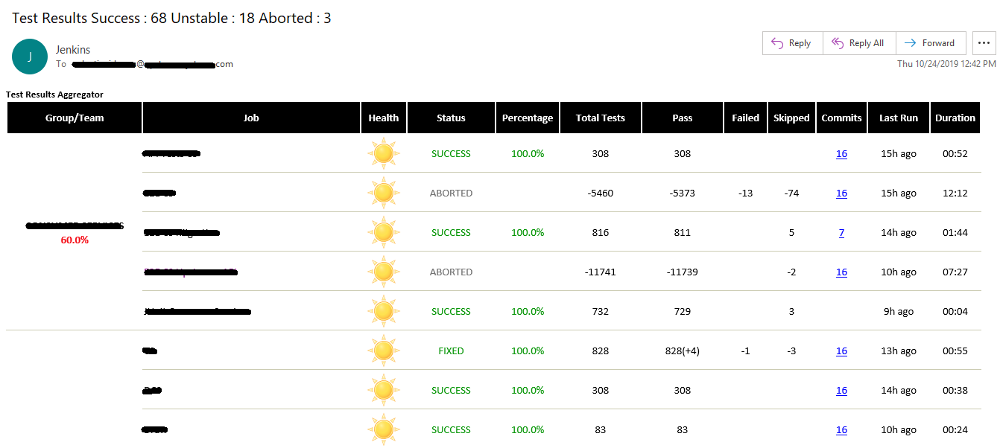
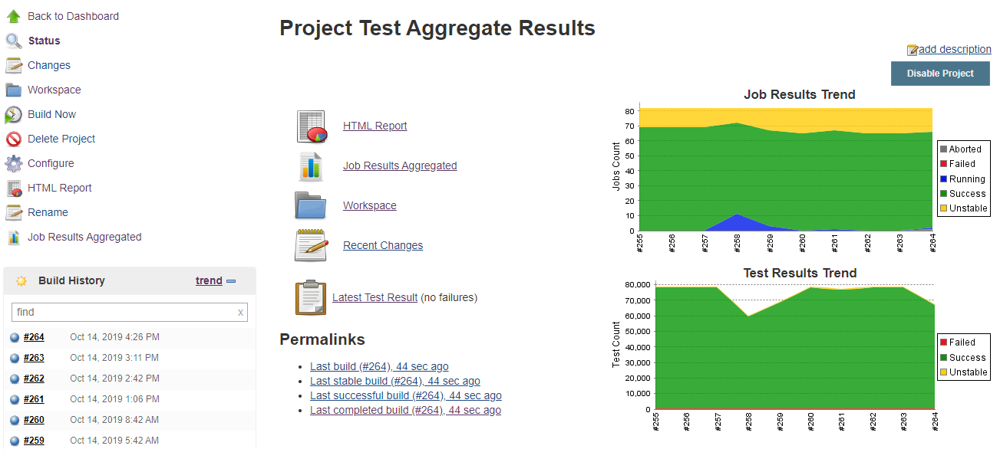
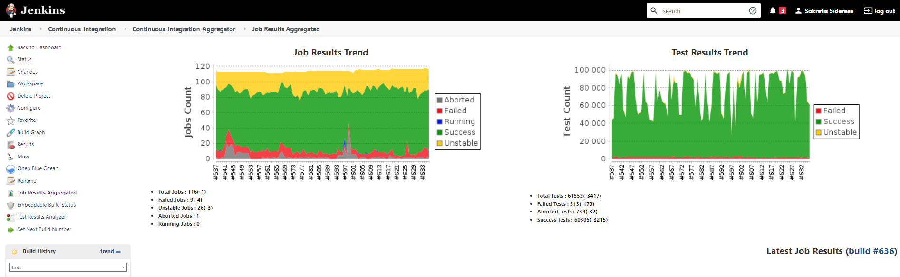
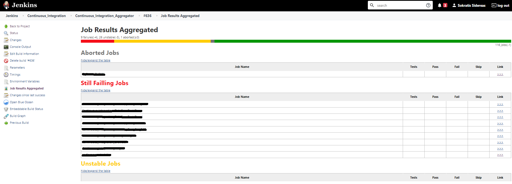
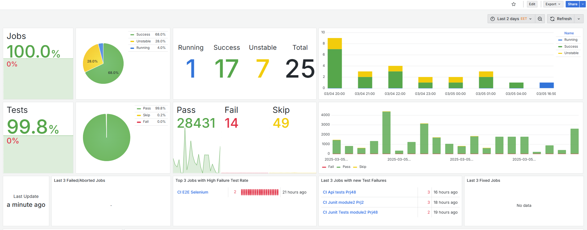
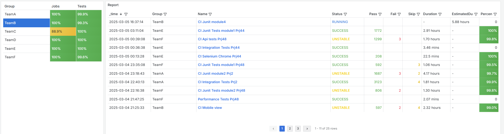
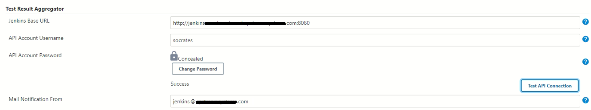

# Test Results Aggregator

A Jenkins plugin that collects test results and job metrics from multiple Jenkins jobs and presents them in consolidated HTML reports, email notifications, and Grafana dashboards.

[](https://plugins.jenkins.io/test-results-aggregator)
[](https://ci.jenkins.io/job/Plugins/job/test-results-aggregator-plugin/)
[](https://github.com/jenkinsci/test-results-aggregator-plugin/actions)
[](https://plugins.jenkins.io/test-results-aggregator)

---

## Overview

Test Results Aggregator is designed to be used as the **last step in a CI/CD pipeline**. It queries multiple Jenkins jobs via the Jenkins API, aggregates their test and coverage results, and produces unified reports for teams, products, or testing types.

### Supported Test Frameworks

| Framework | Jenkins Plugin |
| --- | --- |
| JUnit | [junit](https://plugins.jenkins.io/junit) |
| TestNG | [testng-plugin](https://plugins.jenkins.io/testng-plugin) |
| NUnit | [nunit](https://plugins.jenkins.io/nunit) |

### Supported Coverage Frameworks

| Framework | Jenkins Plugin |
| --- | --- |
| JaCoCo | [jacoco](https://plugins.jenkins.io/jacoco) |

---

## Screenshots

| HTML Report | Main View |
| --- | --- |
|  |  |
|  |  |
|  |  |

---

## Requirements

- Jenkins **2.426.3** or later
- Java **11** or later
- For email notifications: SMTP server configured via the [Mailer plugin](https://plugins.jenkins.io/mailer)
- For Grafana integration: a running InfluxDB instance

> All jobs being aggregated must publish their own test results (JUnit/TestNG/NUnit) and coverage results (JaCoCo) individually before this plugin can collect them.

---

## Installation

Install via **Jenkins Plugin Manager**:

1. Navigate to `Manage Jenkins` → `Manage Plugins` → `Available`
2. Search for **Test Results Aggregator**
3. Install and restart Jenkins

---

## Configuration

### Global Configuration

Navigate to `Manage Jenkins` → `Configure System` → scroll to **Test Result Aggregator**.



| Argument | Description |
| --- | --- |
| Jenkins Base URL | The HTTP address of your Jenkins instance, e.g. `http://yourhost.yourdomain/jenkins/`. Used to access the Jenkins API. |
| Jenkins Account Username | Username of the account used to access the Jenkins API and fetch job results. |
| Jenkins Account Password/Token | Password or API token for the account above. |
| Mail Notification From | Sender address for email notifications. Defaults to `Jenkins`. |

---

### Job Configuration

The plugin supports both **FreeStyle** and **Pipeline** job types.

- [FreeStyle Job Configuration](docs/README_FreeStyle.md)
- [Pipeline Syntax Reference](docs/README_Pipeline.md)

---

## Pipeline Usage

### Minimal Example

```groovy
stage("Report") {
    testResultsAggregator jobs: [
        [jobName: 'My CI Job1'],
        [jobName: 'My CI Job2'],
        [jobName: 'My CI Job3']
    ]
}
```

### With Groups, Columns, and Email

```groovy
testResultsAggregator(
    columns: 'Job, Build, Status, Percentage, Total, Pass, Fail',
    recipientsList: 'nick@some.com,mairy@some.com',
    outOfDateResults: '10',
    sortresults: 'Job Name',
    subject: 'Test Results',
    jobs: [
        [jobName: 'My CI Job1', jobFriendlyName: 'Job 1', groupName: 'TeamA'],
        [jobName: 'My CI Job2', jobFriendlyName: 'Job 2', groupName: 'TeamA'],
        [jobName: 'My CI Job3', groupName: 'TeamB'],
        [jobName: 'My CI Job4', groupName: 'TeamB'],
        [jobName: 'My CI Job6'],
        [jobName: 'My CI Job7']
    ]
)

publishHTML(target: [
    allowMissing: true,
    alwaysLinkToLastBuild: true,
    keepAll: true,
    reportDir: "html",
    reportFiles: 'index.html',
    reportName: "Results"
])
```

### Override Global Configuration

```groovy
testResultsAggregator(
    ignoreDisabledJobs: true,
    ignoreNotFoundJobs: true,
    ignoreRunningJobs: false,
    compareWithPreviousRun: true,
    overrideJenkinsBaseURL: 'https://newjenkinsurl.com',
    overrideAPIAccountUsername: 'myname',
    overrideAPIAccountPassword: 'mypassword',
    jobs: [
        [jobName: 'My CI Job1', jobFriendlyName: 'Job 1', groupName: 'TeamA'],
        [jobName: 'My CI Job2', jobFriendlyName: 'Job 2', groupName: 'TeamA']
    ]
)
```

### Grafana / InfluxDB Integration

```groovy
testResultsAggregator(
    ignoreDisabledJobs: true,
    ignoreNotFoundJobs: true,
    compareWithPreviousRun: true,
    influxdbUrl: 'http://influxdbhost:8086',
    influxdbToken: 'your-influxdb-token',
    influxdbBucket: 'TestResultsAggregatorBucket',
    influxdbOrg: 'MyOrg',
    jobs: [
        [jobName: 'My CI Job1', jobFriendlyName: 'Job 1', groupName: 'TeamA'],
        [jobName: 'My CI Job2', jobFriendlyName: 'Job 2', groupName: 'TeamA'],
        [jobName: 'My CI Job3', groupName: 'TeamB'],
        [jobName: 'My CI Job4', groupName: 'TeamB']
    ]
)
```

---

## Pipeline Parameters Reference

### `jobs` entries

| Field | Required | Description |
| --- | --- | --- |
| `jobName` | Yes | Exact Jenkins job name. For jobs inside folders use `folderName/jobName` or `folder1/folder2/jobName`. |
| `jobFriendlyName` | No | Display name used in reports. Falls back to `jobName` if omitted. |
| `groupName` | No | Groups jobs in the report (e.g. by team, product, or test type). |

### Report & Email Options

| Argument | Description |
| --- | --- |
| `columns` | Comma-separated list of columns to include. Possible values: `Health`, `Job`, `Status`, `Percentage`, `Total`, `Pass`, `Fail`, `Skip`, `Commits`, `LastRun`, `Duration`, `Description`, `Packages`, `Files`, `Classes`, `Methods`, `Lines`, `Conditions`, `Sonar`, `Build` |
| `recipientsList` | Comma-separated To recipients. Leave empty to skip email. Supports job variables, e.g. `${my_param}`. |
| `recipientsListCC` | Comma-separated CC recipients. Supports job variables. |
| `recipientsListBCC` | Comma-separated BCC recipients. Supports job variables. |
| `recipientsListIgnored` | Recipients to notify about ignored jobs. |
| `subject` | Email subject prefix. Supports job and environment variables. |
| `beforebody` | Plain text or HTML to prepend to the email body. Supports job and environment variables. |
| `afterbody` | Plain text or HTML to append to the email body. Supports job and environment variables. |
| `theme` | Report/email theme. Options: `light`, `dark` |
| `sortresults` | Sort order for the report. Options: `Job Name`, `Job Status`, `Total Tests`, `Pass Tests`, `Failed Tests`, `Skipped Tests`, `Percentage`, `Commits`, `Time Stamp`, `Duration`, `Build Number` |

### Behaviour Options

| Argument | Description |
| --- | --- |
| `outOfDateResults` | Mark jobs whose last result is older than X hours with red in the `Last Run` column. Leave blank to show timestamps without highlighting. |
| `compareWithPreviousRun` | Show deltas (+ / -) compared to the previous run for statuses, test counts, and coverage. Options: `true` / `false` |
| `ignoreAbortedJobs` | Exclude jobs with status `ABORTED` from the report. Options: `true` / `false` |
| `ignoreDisabledJobs` | Exclude jobs with status `DISABLED` from the report. Options: `true` / `false` |
| `ignoreNotFoundJobs` | Exclude jobs that could not be found. Options: `true` / `false` |
| `ignoreRunningJobs` | If `true`, report the previous result for currently running jobs and mark them with an asterisk. If `false`, report status as `RUNNING`. Options: `true` / `false` |

### Override Global Configuration

| Argument | Description |
| --- | --- |
| `overrideJenkinsBaseURL` | Override the Jenkins base URL set in Global Configuration. |
| `overrideAPIAccountUsername` | Override the API username set in Global Configuration. |
| `overrideAPIAccountPassword` | Override the API password/token set in Global Configuration. |

### Grafana / InfluxDB Options

| Argument | Description |
| --- | --- |
| `influxdbUrl` | InfluxDB URL, e.g. `http://influxdbhost:8086` |
| `influxdbToken` | InfluxDB access token |
| `influxdbBucket` | InfluxDB bucket name |
| `influxdbOrg` | InfluxDB organisation name |

---

## Grafana Integration

A sample Grafana dashboard is provided in [`docs/grafana/Test Results Aggregator.json`](docs/README_GrafanaSamples.md). Import it into your Grafana installation. The sample uses a bucket named `TestResultsAggregatorBucket` — update it to match your `influxdbBucket` value.

Requires an InfluxDB data source already configured in Grafana.

---

## Release Notes

Full release history is on the [GitHub Releases page](https://github.com/jenkinsci/test-results-aggregator-plugin/releases).

| Version | Notes |
| --- | --- |
| 1.1.x | Requires Jenkins < 2.277 |
| 1.2.x | Requires Jenkins >= 2.277 |
| 2.x | Integrated with the Jenkins client library |
| 2.1.x | Java 11 support |
| 3.x | Grafana / InfluxDB integration added |

---

## Links

- [Jenkins.io CI build](https://ci.jenkins.io/job/Plugins/job/test-results-aggregator-plugin/)
- [FreeStyle Job Configuration](docs/README_FreeStyle.md)
- [Pipeline Syntax Reference](docs/README_Pipeline.md)
- [Grafana Dashboard Samples](docs/README_GrafanaSamples.md)
- [Contributing](docs/CONTRIBUTING.md)
